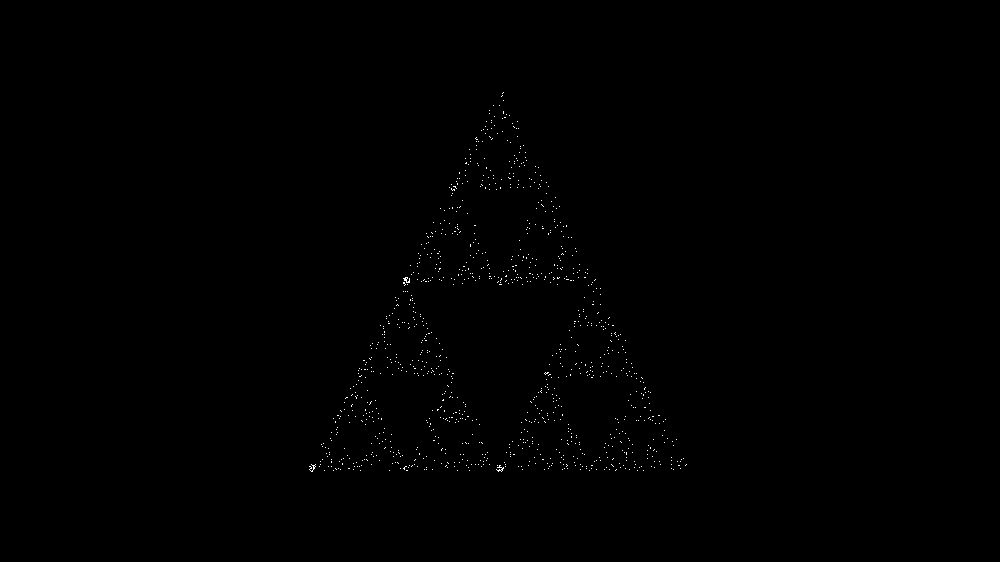

# love2d_fractal_shaders
GLSL-Shaders rendering fractals using lua love2d

Note that the GLSL is some special version of GLSL specifically designed for love2d. If you want to use one of these shaders in another program/framework, some minimal adjustments might be required.
Also be aware that the barnsley fern and the sierpinski triangle are computationally more intensive, since they are IFS (iterated function system) -fractals. This means each point depends on the previous one.

Screenshots:

These, and combinations of them also make for really good wallpapers:

